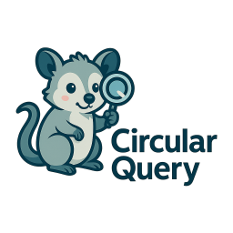
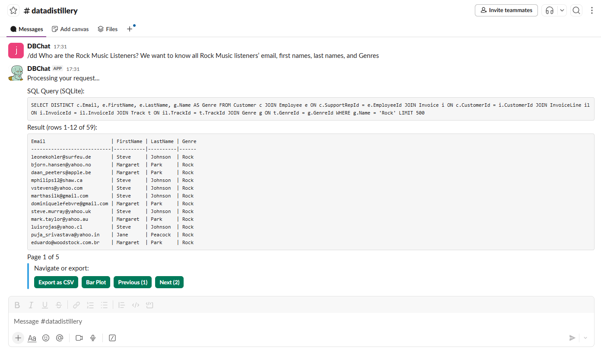
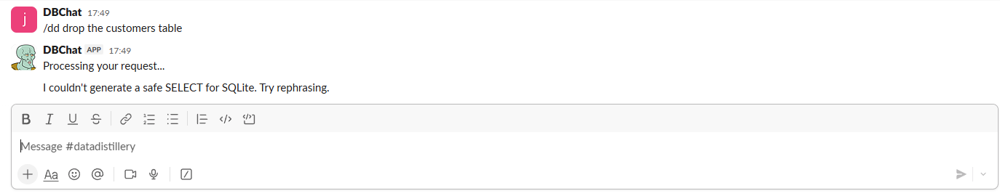
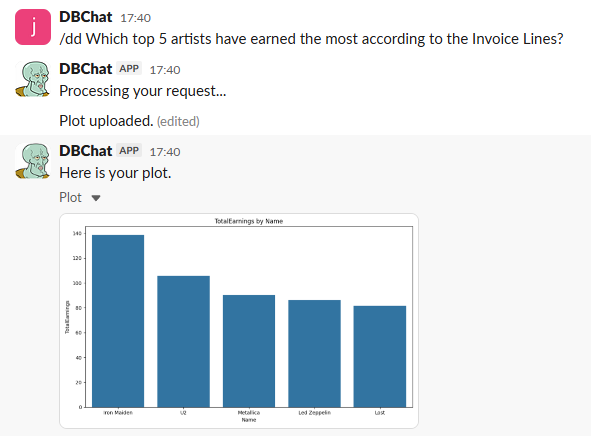

# CircularQuery - Release 1

## RAG for Schema-Scoped SQL Generation (Optional)

This app can optionally use a lightweight RAG layer to scale SQL generation across large schemas without exceeding the LLM context window.

- Embeddings: BAAI/bge-small-en-v1.5 (via sentence-transformers)
- Vector DB: Chroma (local, in-process)
- Scope: Indexes tables and columns; retrieves the most relevant ones per question; injects a compact schema subset into the LLM prompt.

How it works:
1) Indexer reads your DB schema via SQLite PRAGMAs and creates table/column entries with metadata.
2) Retriever embeds the question and queries the local vector DB.
3) LLM prompt uses only the retrieved tables and columns.

Enable RAG:
- Set `USE_RAG=true` in your environment.
- Build the index once: `python -m rag.schema_indexer` (uses configured `SQLITE_PATH`).

Configuration (env):
- USE_RAG=true/false (default false)
- RAG_PERSIST_DIR=./rag_index
- RAG_TOP_K_TABLES=5
- RAG_TOP_N_COLUMNS=8

CLI:
- `python -m rag.schema_indexer --config path/to/schema.yaml` (config is optional; current indexer introspects the SQLite DB).

Fallback behavior:
- If RAG is disabled or retrieval fails, the system falls back to the full schema prompt and logs a warning.

## Your Local AI data analyst - inside Slack
<div style="display: flex; align-items: center; gap: 12px;">
  
  <p>
    Ask questions in Slack → get <strong>safe, read-only SQL</strong> (SQLite) via
    <strong>Ollama</strong> (local models) or <strong>Groq</strong> (cloud models), plus
    <strong>paginated results</strong>, <strong>CSV export</strong>, and
    <strong>inline plots</strong>.
  </p>
</div>


> Works with `/dd` (CircularQuery SQL assistant), CSV exports, and "Plot Data" interactivity.

---

## Demo (what it does)

### **Three Powerful Commands:**

#### **`/dd` - Direct Data Queries**
- `/dd top 10 tracks by revenue last year`
  - Generates a **SQLite SELECT** using your schema
  - Executes against **Chinook** (or your DB)
  - Replies with a paginated table
  - Buttons: **Export CSV**, **📊 Bar Plot**, **📈 Line Plot**, **🥧 Pie Chart** (choose X/Y, uploads chart), **🔍 Insights** (AI-powered analysis)

#### **`/askdb` - Intelligent Business Analysis**
- `/askdb why did sales drop last month?`
  - **Smart routing**: Simple queries → fast processing, Complex questions → agentic analysis
  - **Iterative investigation**: Multi-step reasoning for complex questions
  - **Business insights**: Comprehensive analysis with specific recommendations
  - **Database agnostic**: Works with any schema (F1, e-commerce, HR, finance, etc.)

#### **`/datastory` - AI Data Stories with Visualizations** ⭐ **NEW!**
- `/datastory tell me about customer behavior trends`
  - **Comprehensive analysis**: 1200-word structured reports with 5-part narrative
  - **AI-generated visualizations**: Whiteboard-style charts and insights using Z-Image-Turbo
  - **Professional presentation**: Clean, modern data story format perfect for stakeholders
  - **End-to-end storytelling**: From raw data to actionable business narrative

### `/dd` Query Examples:

### Simply use /dd 'your data question'


### `/askdb` Business Analysis Examples:
**Simple Questions** (fast routing):
- `/askdb show me top 5 customers`
- `/askdb count all orders`
- `/askdb list product categories`

**Complex Analysis** (agentic investigation):
- `/askdb why did revenue drop in Q3?`
- `/askdb what patterns do you see in customer behavior?` 
- `/askdb analyze performance trends over time`
- `/askdb what should I know about this dataset?`

### Security & Visualization:



---

## Quickstart

### 1) Prereqs
- Python 3.10+  
- Slack workspace where you can install custom apps
- **Either:** [Ollama](https://ollama.com/) running locally **OR** [Groq API key](https://console.groq.com)
- SQLite DB (Chinook recommended for demo)

### 2) Clone & install

`git clone https://github.com/johnpower493/CircularQuery.git` \
`cd CircularQuery` \
`python -m venv .venv && source .venv/bin/activate  # Windows: .venv\Scripts\activate` \
`pip install -r requirements.txt` \

### 3) Set up your LLM backend

**Option A: Local LLM with Ollama (privacy-first)**
Pull a local model (examples):
```bash
ollama pull granite4
ollama pull qwen3:4b
```

**Option B: Cloud LLM with Groq (speed-first)**
Sign up for a free Groq account at https://console.groq.com and get an API key.

### 4) Copy env and set tokens
cp .env.example .env
# then edit .env
```
.env keys

**Required:**
SLACK_BOT_TOKEN — from "Install App" → Bot User OAuth Token (xoxb-...)

**LLM Backend (choose one):**
LLM_BACKEND — "ollama" (local) or "groq" (cloud)

**For Ollama (local):**
OLLAMA_BASE_URL — default http://127.0.0.1:11434
OLLAMA_MODEL — e.g. granite4, qwen3:4b

**For Groq (cloud):**
GROQ_API_KEY — your Groq API key (gsk_...)
GROQ_MODEL — e.g. llama-3.1-8b-instant, openai/gpt-oss-20b

**Database:**
SQLITE_PATH — ./chinook.db (or your DB)

**For AI Data Stories (optional, requires GPU):**
The `/datastory` command uses Z-Image-Turbo for AI visualizations. For best performance:
- NVIDIA GPU with CUDA support
- At least 8GB VRAM recommended
- Will gracefully degrade to text-only stories without GPU

**Optional:**
SCHEMA_YAML_PATH — override auto-introspection
```

### 5) Slack app setup (one-shot manifest)

In api.slack.com/apps
 → Create New App → From an app manifest

Pick your workspace → paste the manifest from manifests/slack_app_manifest.yaml (below).

Install the app to your workspace.

In Interactivity & Shortcuts:

Turn Interactivity ON

Request URL: https://<your-ngrok-domain>/slack/interactions

In each Slash Command edit page, set the Request URL to your public URL paths:

/dd → https://<your-ngrok-domain>/slack/sqlquery

/askdb → https://<your-ngrok-domain>/slack/askdb

/datastory → https://<your-ngrok-domain>/slack/datastory

/help → https://<your-ngrok-domain>/slack/help

If you’re local, run ngrok (or Cloudflare tunnel):
ngrok http http://localhost:5000

### 6) Run the app
`python app.py`

### 7) In Slack

Invite the bot/app to your channel: /invite @CircularQuery

**Try Data Queries:**
- `/dd top 5 customers by total spend`
- Use the Export CSV / 📊 Bar Chart / 📈 Line Chart / 🥧 Pie Chart / 🔍 Insights buttons

**Try Business Analysis:**
- `/askdb what can you tell me about my customers?`
- `/askdb why are sales trending down?`
- `/askdb which products are most profitable?`

**Try Data Stories:**
- `/datastory what can you tell me about customer behavior?`
- `/datastory show me revenue trends and insights`
- `/datastory tell me about product performance patterns`

### Architecture
```
Slack Slash Commands (/dd, /askdb, /datastory, /help)  +  Interactivity (Buttons/Selects)
                | (HTTP Webhooks)
                v
           Flask Server + Smart Query Router
                |                     |                     |
        Simple Questions      Complex Questions       Data Stories
                |                     |                     |
                v                     v                     v
        /dd Processing        True Agentic System    AI Story Generator
    (Fast: 1 LLM call)      (Thorough: Multi-iteration)  (Comprehensive Analysis)
                |                     |                     |
                v                     v                     v
           Guardrails (SELECT-only, LIMIT, timeouts)      |
                |                     |                     |
                v                     v                     v
    Ollama (Local) OR Groq (Cloud)  ——>  SQL (SQLite dialect)
                |                     |                     |
                v                     v                     v
          SQLite (read-only) → results → CSV / Plot → Slack files.upload
                                |                     |
                                v                     v
                Business Intelligence Synthesis    Z-Image-Turbo AI
                                                 (Whiteboard Visualizations)
```

### Security & Guardrails

Read-only DB (SQLite opened with mode=ro)

SQL allowlist: only SELECT (+ optional CTE WITH)

Auto-append LIMIT (defaults to 500 unless provided)

Simple timeout on LLM call; result size caps for CSV

### Config / Env

**Required:**
- SLACK_BOT_TOKEN: bot token with chat:write, chat:write.public, files:write, commands

**Optional:**
- OLLAMA_MODEL: e.g. qwen3:4b
- SQLITE_PATH: path to your DB, default ./chinook.db
- **QUERY_LIMIT**: Row limit for `/dd` commands (default: 500)
  - Set to `0` or negative value to disable limit entirely
  - Example: `QUERY_LIMIT=1000` or `QUERY_LIMIT=0` for unlimited
